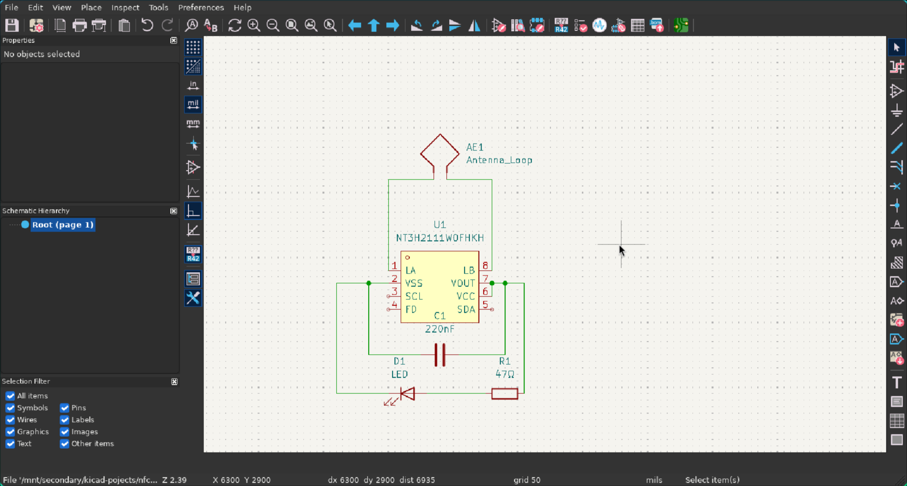

# NFC card
All this is is a NTAG 211, a warm white led, a cap, and a resister. the hardest part was figuring out how to make the antenna because i couldn't find a exsisting footprint for one like exsists for easyeda.

I have wanted to play around with NFC stuff for a while but just haven't got around to buying any NFC cards or pucks and i though i've been invited to share The Book of Mormon so i might as well make a custom NFC card to make sharing it easier.

To use this project all you need to do is order it as a PCBA (unless you want to hand solder smd componets) using the components listed in the BOM.

## Images

3d model front

3D model back

# BOM:

| Item Count | Item Name        | Unit Price | Total Price | Price with discount | Link                                                             | Running Total | Running Total with discounts | lcsc/jlcpcb part number | customer part number | Notes                                                |
|------------|------------------|------------|-------------|---------------------|------------------------------------------------------------------|---------------|------------------------------|-------------------------|----------------------|------------------------------------------------------|
| 20         | Warm white LED   | 0.0135     | 0.27        | 0.27                | https://jlcpcb.com/partdetail/XINGLIGHT-XL2012WWC/C965820        | 0.29          | 0.29                         | C965820                 | 1                    |                                                      |
| 20         | 47Ω resistor     | 0.0004     | 0.01        | 0.01                | https://jlcpcb.com/partdetail/GiantOhm-GR0402J47RTAG00/C49653152 | 0.3           | 0.3                          | C49653152               | 2                    | love how cheap smd parts are from jlcbcp for pcba    |
| 5          | NTAG I²C plus 1K | 0.08015    | 0.4         | 0.4                 | https://jlcpcb.com/partdetail/NXPSemicon-NT3H2111W0FTTJ/C2654884 | 0.72          | 0.72                         | C2654884                | 3                    |                                                      |
| 5          | 220nF capaciter  | 0.0016     | 0.01        | 0.01                | https://jlcpcb.com/partdetail/HRE-CGA0402X5R224K100GT/C7503518   | 0.73          | 0.73                         | C49653152               | 4                    |                                                      |
| 1          | PCBA             | 27.9       | 27.9        | 18.9                |                                                                  | 30.3          | 20.76                        |                         | 5                    | i have a $9 smt coupon that i can use after the 23rd |
| 1          | pcb              | 3.3        | 3.3         | 3.3                 | jlcpcb.com                                                       | 33.8          | 24.26                        |                         | 6                    |                                                      |
| 1          | Shipping         | 11.8       | 11.8        | 11.8                | jlcpcb.com                                                       | 46.31         | 36.77                        |                         |                      |                                                      |